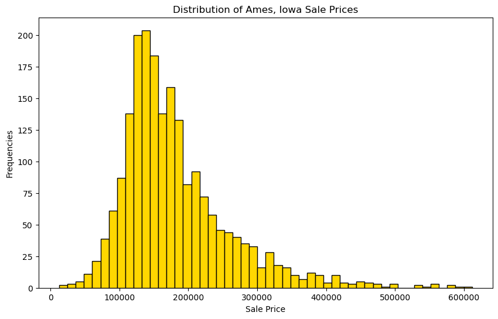
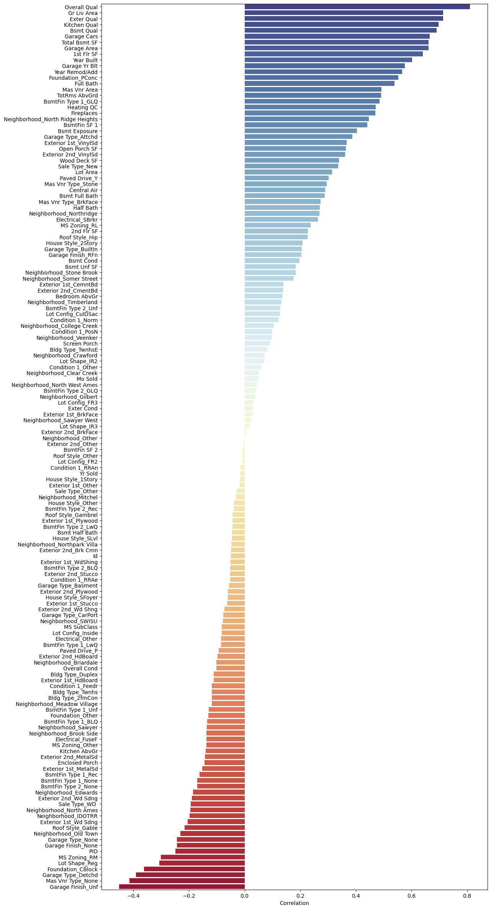

# A Comprehensive Study of the Factors that Affect Home Prices in Ames, Iowa

---

## Contents:

- [Problem Statement](#Problem-Statement)
- [Background](#Background)
- [Datasets](#Datasets)
- [Exploratory Data Analysis and Pre-Processing (EDA)](#Exploratory-Data-Analysis-and-Pre-Processing-(EDA))
- [Correlation of All Features with Target](#Correlation-of-All-Features-with-Target)
- [Feature Engineering](#Feature-Engineering)
- [Normalization with Ridge and Lasso](#Normalization-with-Ridge-and-Lasso)
- [Model Evaluation](#Model-Evaluation)
- [Conclusions and Recommendations](#Conclusions-and-Recommendations)

---

### Problem Statement

As a realtor company operating in Ames, Iowa, our goal is to help our clients make informed decisions when buying or selling a home. One of the key factors that our clients consider is the price of the property, and we want to develop a reliable regression model that can accurately predict the prices of homes in this area. By analyzing a dataset of previous home sales in Ames and identifying the key features that impact home prices, we aim to create a regression model that can be used to predict future prices based on a variety of property characteristics. Our ultimate goal is to provide our clients with a powerful tool that can help them make smart and profitable real estate decisions.

---

### Background

The real estate market in Ames, Iowa has seen significant growth over the past decade, with a steady increase in home prices and a high demand for quality housing. As a result, there is a growing need for accurate predictions of home prices in this area, both for home buyers looking to make a wise investment and for realtors seeking to offer valuable insights to their clients.

To address this need, our realtor company is undertaking a project to develop a regression model that can predict home prices in Ames based on a variety of key factors. By analyzing a dataset of past home sales and identifying the most significant features that impact home prices, we aim to build a reliable and accurate model that can help our clients make informed decisions about their real estate investments.

This project represents a significant opportunity for our company to provide a valuable service to our clients, while also gaining a deeper understanding of the complex factors that drive home prices in the Ames real estate market. Through careful analysis and rigorous testing, we believe that we can develop a powerful tool that will help our clients maximize their investments and achieve their real estate goals.

---

### Datasets

The raw dataset provided from Kaggle: consisting 80 variables that could impact on house prices.

|Feature|Type|Description|
|---|---|---|
|SalePrice|Numeric(Continious)|the property's sale price in dollars. This is the target variable that you're trying to predict|.
|MSSubClass|Numeric(Discrete)|The building class|
|MSZoning|Object(Cetagorical)|The general zoning classification|
|LotFrontage|Numeric(Continious)|Linear feet of street connected to property|
|LotArea|Numeric(Continious)|Lot size in square feet|
|Street|Object(Cetagorical)|Type of road access|
|Alley|Object(Cetagorical)|Type of alley access|
|LotShape|Object(Cetagorical)|General shape of property|
|LandContour|Object(Categorical)|Flatness of the property|
|Utilities|Object(Categorical)|Type of utilities available|
|LotConfig|Object(Categorical)|Lot configuration|
|LandSlope|Object(Categorical)|Slope of property|
|Neighborhood|Object(Categorical)|Physical locations within Ames city limits|
|Condition1|Object(Categorical)|Proximity to main road or railroad|
|Condition2|Object(Categorical)|Proximity to main road or railroad (if a second is present)|
|BldgType|Object(Categorical)|Type of dwelling|
|HouseStyle|Object(Categorical)|Style of dwelling|
|OverallQual|Numeric(Discrete)|Overall material and finish quality|
|OverallCond|Numeric(Discrete)|Overall condition rating|
|YearBuilt|Numeric(Discrete)|Original construction date|
|YearRemodAdd|Numeric(Discrete)|Remodel date|
|RoofStyle|Object(Categorical)|Type of roof|
|RoofMatl|Object(Categorical)|Roof material|
|Exterior1st|Object(Categorical)|Exterior covering on house|
|Exterior2nd|Object(Categorical)|Exterior covering on house (if more than one material)|
|MasVnrType|Object(Categorical)|Masonry veneer type|
|MasVnrArea|Numeric(Continious)|Masonry veneer area in square feet|
|ExterQual|Object(Categorical)|Exterior material quality|
|ExterCond|Object(Categorical)|Present condition of the material on the exterior|
|Foundation|Object(Categorical)|Type of foundation|
|BsmtQual|Object(Categorical)|Height of the basement|
|BsmtCond|Object(Categorical)|General condition of the basement|
|BsmtExposure|Object(Categorical)|Walkout or garden level basement walls|
|BsmtFinType1|Object(Categorical)|Quality of basement finished area|
|BsmtFinSF1|Numeric(Continious)|Type 1 finished square feet|
|BsmtFinType2|Object(Categorical)|Quality of second finished area (if present)|
|BsmtFinSF2|Numeric(Continious)|Type 2 finished square feet|
|BsmtUnfSF|Numeric(Continious)|Unfinished square feet of basement area|
|TotalBsmtSF|Numeric(Continious)|Total square feet of basement area|
|Heating|Object(Categorical)|Type of heating|
|HeatingQC|Object(Categorical)|Heating quality and condition|
|CentralAir|Object(Categorical)|Central air conditioning|
|Electrical|Object(Categorical)|Electrical system|
|1stFlrSF|Numeric(Continious)|First Floor square feet|
|2ndFlrSF|Numeric(Continious)|Second floor square feet|
|LowQualFinSF|Numeric(Continious)|Low quality finished square feet (all floors)|
|GrLivArea|Numeric(Continious)|Above grade (ground) living area square feet|
|BsmtFullBath|Numeric(Discrete)|Basement full bathrooms|
|BsmtHalfBath|Numeric(Discrete)|Basement half bathrooms|
|FullBath|Numeric(Discrete)|Full bathrooms above grade|
|HalfBath|Numeric(Discrete)|Half baths above grade|
|Bedroom|Numeric(Discrete)|Number of bedrooms above basement level|
|Kitchen|Numeric(Discrete)|Number of kitchens|
|KitchenQual|Object(Categorical)|Kitchen quality|
|TotRmsAbvGrd|Numeric(Discrete)|Total rooms above grade (does not include bathrooms)|
|Functional|Object(Categorical)|Home functionality rating|
|Fireplaces|Numeric(Discrete)|Number of fireplaces|
|FireplaceQu|Object(Categorical)|Fireplace quality|
|GarageType|Object(Categorical)|Garage location|
|GarageYrBlt|Numeric(Discrete)|Year garage was built|
|GarageFinish|Object(Categorical)|Interior finish of the garage|
|GarageCars|Numeric(Discrete)|Size of garage in car capacity|
|GarageArea|Numeric(Continious)|Size of garage in square feet|
|GarageQual|Object(Categorical)|Garage quality|
|GarageCond|Object(Categorical)|Garage condition|
|PavedDrive|Object(Categorical)|Paved driveway|
|WoodDeckSF|Numeric(Continious)|Wood deck area in square feet|
|OpenPorchSF|Numeric(Continious)|Open porch area in square feet|
|EnclosedPorch|Numeric(Continious)|Enclosed porch area in square feet|
|3SsnPorch|Numeric(Continious)|Three season porch area in square feet|
|ScreenPorch|Numeric(Continious)|Screen porch area in square feet|
|PoolArea|Numeric(Continious)|Pool area in square feet|
|PoolQC|Object(Categorical)|Pool quality|
|Fence|Object(Categorical)|Fence quality|
|MiscFeature|Object(Categorical)|Miscellaneous feature not covered in other categories|
|MiscVal|Numeric(Continious)|$Value of miscellaneous feature|
|MoSold|Numeric(Discrete)|Month Sold|
|YrSold|Numeric(Discrete)|Year Sold|
|SaleType|Object(Categorical)|Type of sale|

---

### Exploratory Data Analysis and Pre-Processing (EDA)

The exploratory data analysis (EDA) and preprocessing steps involved in this project focused on cleaning and preparing the data for modeling. The EDA phase involved analyzing the data and identifying patterns, trends, and relationships between variables. This included examining the target sale price and its predictors, both numerical and categorical. The preprocessing phase involved several steps, such as handling missing values by dropping columns with more than 10% null values, utilizing imputation techniques, and removing some null values. Outliers were identified and addressed using scatter plots, and categorical variables were transformed using value mapping and one-hot encoding. The neighborhood names were also changed to be more understandable.

### EDA

we could look into the main steps that we made through Exploratory Data Analysis:

 **1. Analyzed the target variable (sale price) by examining its distribution** 

**Number of houses with more than 500,000 sale price: 12** 
**Further in pre-processing we decided to temoved some sale prices that were way outside of the majority of (prices more than 500,000)**

**2. Check the errors (incompatibility) in relationship between basement and Ground variables**
For some variables, such as those related to basement and above ground levels, we examined their compatibility to ensure they were consistent with each other. While there were no issues with the basement variables, we did find some incompatibility in the ground level variables, which we identified and addressed.

**Incompatibility in Ground levels**

We Utilized imputation techniques to address incompatibilities in ground levels

### Preprocessing

The overall aim of the Data Preprocessing phase is to clean and transform the data to make it more suitable for modeling, handle missing data, reduce noise, and improve the performance of the model. This phase typically involves several steps as following:

**Preprocessing Steps**

**1. Handling Missing Values**
We assessed missing values across all variables including numerical and categorical ones and utilized different techniques based on the nature of the data and the amount of missingness. In the following we could see numerical variables with their missing values:

- After identifying missing values in numerical variables, we handled them by dropping columns with more than 10% null values, utilizing imputation techniques, and dropping some null values. 
- We also utilized imputation technique for filling missing values in categorical variables.

**2. Managing Outliers**
Scatter plots can help to identify patterns and trends in the data, and can also highlight any data points that fall outside of the expected range. Once we have identified outliers, we removed them from the dataset to help to improve the accuracy of our analysis and modeling by reducing the impact of extreme values. In the following we could see scatter plots and outliers in some of them:

**3. Handling Categorical Values**
If a categorical variable has very little diversity, meaning that most of the values fall into one or two categories, it may not be useful for our analysis. In this case, we chose to drop the variable entirely, as it is unlikely to provide meaningful information.
However, in some cases, a categorical variable may have many different possible values, but some of these values may occur very rarely. These low-frequency values may not provide enough information to be useful on their own, but they may still contain some valuable information when combined with other similar values.
To address this issue, we created a new category called "Other" and grouped all of the low-frequency values into this category. This can help to simplify the dataset and reduce the number of categories we need to consider in our analysis. In the following we could see the example of each situation that we talked about:

**Categorical variable with lack of diversity**

**Categorical variable with low-frequency values**

**3. Transforming Categorical Values**
Categorical variables are non-numeric data types that represent discrete values. In order to use these variables in our models, we need to convert them into numeric form.

One way to do this is through one-hot encoding, which involves creating a new binary feature for each unique value of a categorical variable. In this case, Each feature would take the value 1 if the original value matches that feature, and 0 otherwise.

Another way to transform categorical variables is through ordinal encoding, which involves assigning a unique integer to each unique value of a categorical variable. 

By transforming categorical variables to numeric form, we can enable our models to use them as predictors and make more accurate predictions.

In the following we could see two types of categorical variables that we transformed them with above techniques:

**Categorical variable that will be transformed with mapping (ordinal one)**

**Categorical variable that will be transformed with one-hot encoding**

**EDA and Pre-processing Summary**
- Conducted exploratory data analysis (EDA) on target sale price and its predictors (numerical and categorical variables)
Addressed null values:
 - Dropped columns with more than 10% null values
 - Utilized imputation techniques
 - Dropped some null values
- Addressed outliers using scatter plots and removed them from the dataset
- Worked on categorical variables:
 - Replaced values with fewer frequencies to "Other"
 - Changed neighborhood names to be more understandable
- Removed some sale prices that were way outside of the majority of prices
- Utilized imputation techniques to address incompatibilities in gr levels

---

### Correlation of All Features with Target

After transforming all categorical features to numerical, by visualizing the correlation between each predictor and the target variable, we can identify which features have the strongest relationship with the target and may be good predictors in your machine learning model. In the following we can see a plot which visualizes the correlation between all predictors and our target Sale Price:

---

### Feature Engineering

After cleaning and preprocessing our data and creating initial regression models, we performed feature engineering to see if we can further improve our model's performance. In this case, we created new features based on the sum of other features and utilized PolynomialFeature engineering.

- To create new features based on the sum of other features, we added together pairs of features that we believed the result may have a strong relationship with the target variable.
- We also utilized PolynomialFeature engineering to create new features that capture nonlinear relationships between the predictors and the target variable. This technique involves creating polynomial terms of existing features, such as squared or cubed terms. Here we will only consider squered term.

By creating new features based on the sum of other features and utilizing PolynomialFeature engineering, we hope to capture more complex relationships between the predictors and the target variable, and improve the accuracy and generalizability of our regression models.

### Create a Large Dataset with Polynomial Features of All Predictors

After applying the polynomial feature transformer on all of our features, we ended up with a large number of features, which leaded to overfitting. To avoid overfitting, we needed to use normalization techniques to make the model more generalized. But, before applying normalization techniques we need to scale our data, which is necessary because our features have different scales. Scaling helps to ensure that all features are equally important during training, regardless of their initial scale. Without scaling, larger features may have a disproportionately greater impact on the model's prediction, which can lead to overfitting. Therefore, we utilized standard scaling to scale our features, which involves transforming the data to have zero mean and unit variance.

### Normalization with Ridge and Lasso

After applying polynomial features and standard scaling on the training data, we observed that the model was extremely overfitted. This means that the model was performing very well on the training data but was not able to generalize well on the unseen data (test data).

To address this issue, we employed Ridge and Lasso normalization techniques. Ridge and Lasso are regularization methods that add a penalty term to the loss function to shrink the coefficients of the predictors towards zero. However, there is a difference between them. Ridge regression adds a penalty term equivalent to the square of the magnitude of the coefficients, while Lasso regression adds a penalty term equivalent to the absolute magnitude of the coefficients.

Moreover, we utilized Ridge CV and Lasso CV techniques. Ridge CV and Lasso CV are similar to Ridge and Lasso, respectively, but they use cross-validation to find the best value of the regularization parameter alpha. This helps to select the optimal value of alpha, which balances the trade-off between the bias and variance of the model.

---

### Model Evaluation

In this phase, we compared six different models to determine the best performing one:
- The First Model **(Baseline)**: which was based solely on numerical features before transforming categorical features into numerical ones. We utilized cross-validation and a linear model to obtain the baseline score.
- The Second Model **(Regression Model)**: Involved a regression model on all features.
- The Third Model **(Regression on Engineered Features)**: Incorporated feature engineering and added some engineered features.
- The Fourth Model **(Overfitted Model)**: We then created an overfitted model by applying a polynomial transformer with a second degree on all features, resulting in the fourth model.
- The Fith Model **(Ridge CV Regression Model)**: To prevent overfitting, we utilized normalization technique and created the fifth model with Ridge CV.
- The Sixth Model **(Lasso CV Regression Model)**: To prevent overfitting, we utilized another normalization technique and created the sixth model with Lasso CV.

In the following table we could see the models with their scores:

|Model|MSE Score|RMSE Score|Test R-Squered Score|
|---|---|---|---|
|Baseline|---|---|0.8788|
|Regression|421685876.9387207|20534.991525167978|0.9212|
|Regression on Engineered Features|337570067.90575826|18373.079978755828|0.9369|
|Overfitted Model|938254321.4937987|30630.93732639925|0.8248|
|Ridge CV Regression Model|359520615.6486912|18961.028865773376|0.9328|
|Lasso CV Regression Model|326008366.9197571|18055.701784194298|0.9391|

The third and sixth models received the highest scores in terms of R-squared, RMSE, and MASE, with the sixth model being slightly better. However, it was extremely overfitted and could not be used for any prediction without normalization. The third model had less features, less overfitting, and was more interpretable. We believe that by working on the relationship of the features and creating more meaningful engineered features, we could further improve its performance.

---

### Conclusions and Recommendations

### Conclusions

- Through careful analysis and modeling, we have developed a reliable and accurate regression model for predicting home prices in Ames, Iowa.
- Our model takes into account a wide range of key features, including property area, Quality ratings, Builtimg year, location, condition, and amenities, among others.
- By utilizing advanced techniques such as feature engineering, polynomial transformation, and regularization, we were able to improve the performance of our model and achieve strong results in terms of R-squared and RMSE scores.
- We believe that our model can be a valuable tool for our clients, helping them to make informed decisions about their real estate investments and achieve their financial goals.

### Recommendations

- In order to further improve the performance of our model, we recommend that we continue to refine and optimize our feature engineering techniques, exploring new ways to extract meaningful information from our predictors.
- We also suggest that we consider incorporating additional data sources, such as demographic and economic data, to provide a more comprehensive view of the factors that impact home prices in Ames.
- Finally, we recommend that we continue to monitor the real estate market in Ames and update our model regularly to ensure that it remains relevant and accurate over time.

Overall, this project represents a significant opportunity for our company to provide a valuable service to our clients, while also gaining a deeper understanding of the complex factors that drive home prices in the Ames real estate market. By continuing to refine and improve our regression model, we can provide our clients with the best possible insights and advice to help them achieve their real estate goals.
